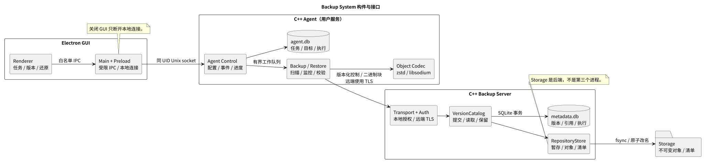
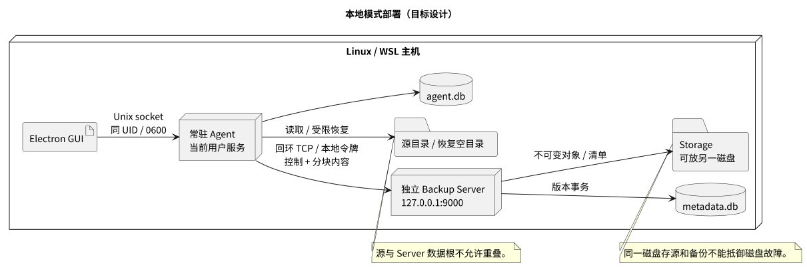
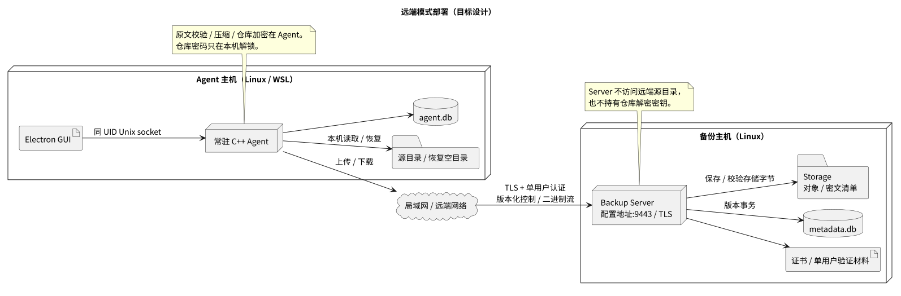
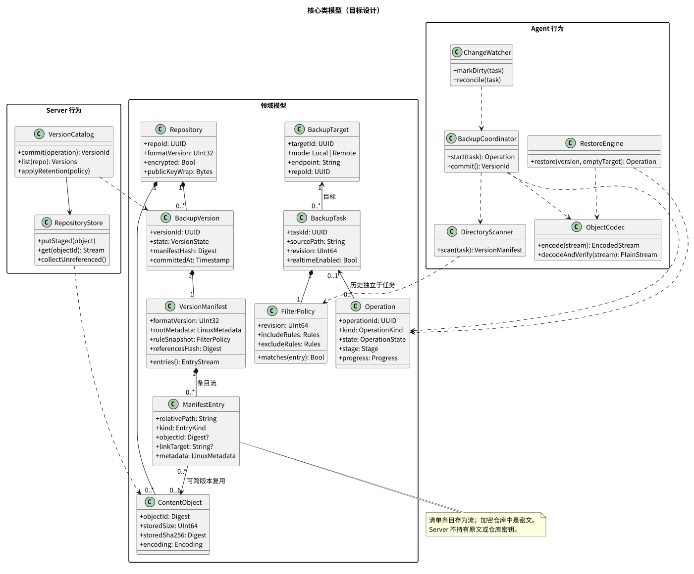
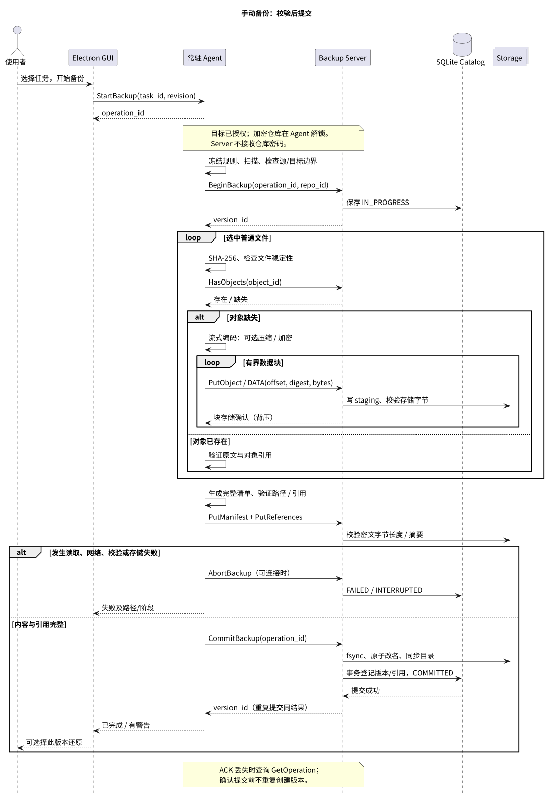
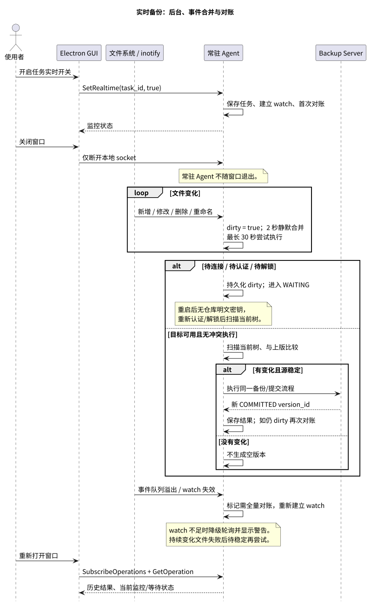
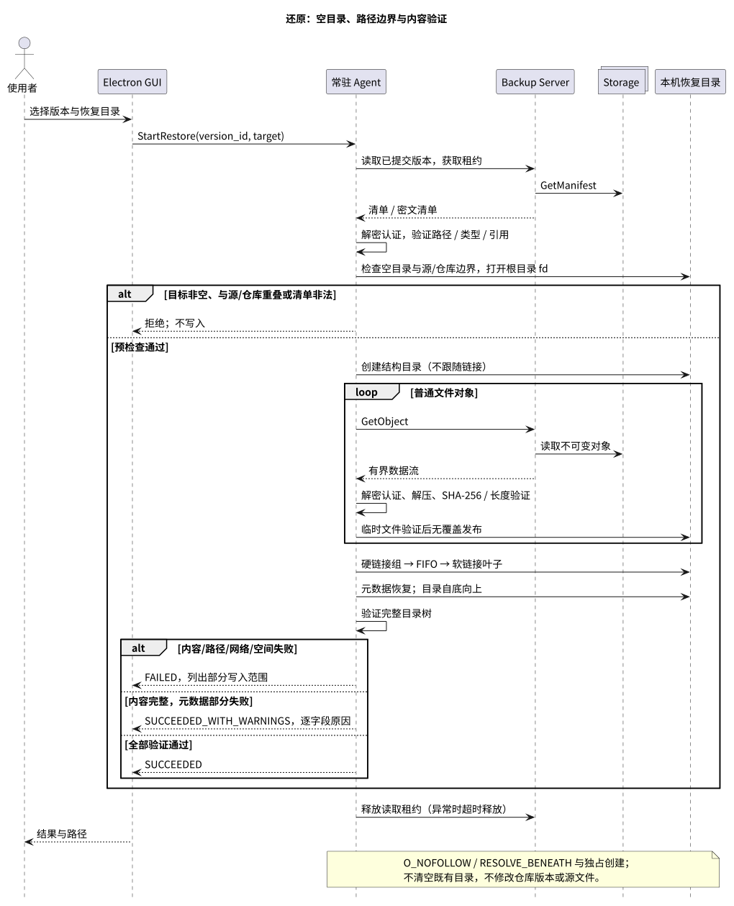
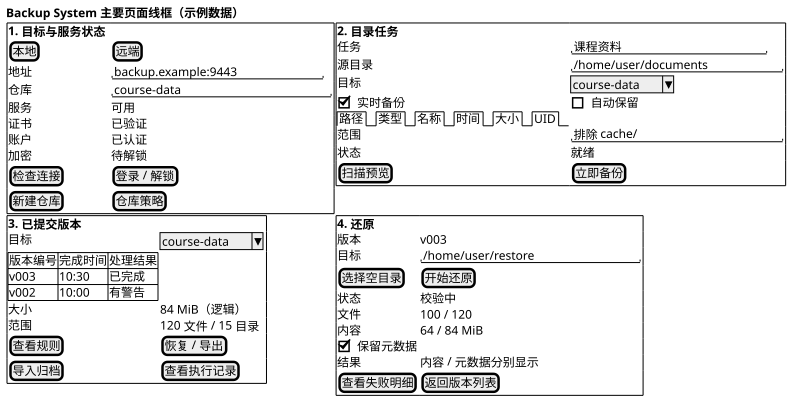
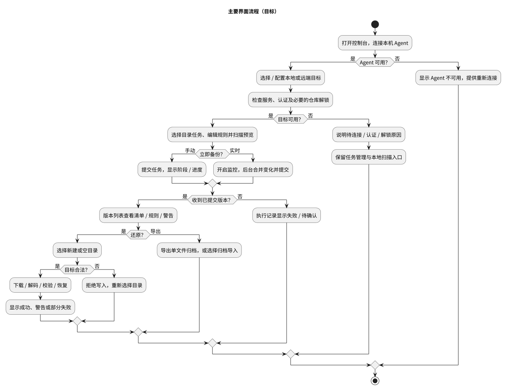

# Backup System 系统设计文档

| 项目 | 内容 |
| --- | --- |
| 课程 | 软件开发综合实验 |
| 项目 | Backup System 数据备份与还原软件 |
| 文档版本 | 1.0，目标设计评审版 |
| 更新日期 | 2026-10-01 |
| 项目组与成员 | 提交前填写实际信息 |
| 需求基线 | [需求分析说明书](requirements.md) 1.0 |

> 本文主体规定最终目标设计。更新至 2026-10-08 的基础功能实现见第 1.0 节；其他接口、数据库及扩展仍按阶段实施。附录 A 保留 2026-10-01 的原型快照，实际验证见测试报告。

## 1. 设计依据与总体架构

### 1.0 当前基础实现（2026-10-08）

当前实现覆盖 FR-01—06、FR-17 的 P0 本地行为，以及 FR-10 特殊文件类型，并接入 FR-07 的基础操作界面；真实掉电等验收边界见测试报告，导出保留到 P2。实现采用现有 Qt Core/Network、JSON 帧和 Electron 子进程结构，以下明确其与后续架构设计的区别：

| 部分 | 当前基础实现 |
| --- | --- |
| 配置与记录 | Agent 独占 `--state-dir`，`config.json` 保存任务/目标，`operations/<id>.json` 保存阶段、计数、结果及错误；QSaveFile 原子替换，旧 tasks.json 导入一次并保留。目标设置可在执行中保存，工作线程继续使用开始时的副本；可选 repository_path 校验本机 Server 的实际仓库，别名目标也不能重复添加同一来源 |
| 来源选择 | `preview_sources` 校验绝对路径、合并重复/被包含项，返回来源类型及还原路径；`add_task` 的 sources 支持文件、文件夹和混合选择，可带 name。旧 path 接口保持整目录语义。最多 100 个显式来源、16 KiB 选择记录；Main 的文件与文件夹选择器均允许多选 |
| 类型筛选 | 新建任务的 file_types 允许 file、symlink、fifo、character_device、block_device、socket，后三类默认不选；preserve_empty_dirs 独立控制空目录、默认 true。直接选择的非目录在路径合并前检查，文件夹始终递归遍历。扫描/上传共用遍历器；含新节点类型的任务配置格式 5 拒绝旧 Agent，Server 保存并回执规则，版本还原再次校验；格式 3、4 旧类型规则按原语义读取 |
| 可用性 | ping 保留协议握手；认证后的 health 检查数据库、暂存和版本目录可列举，并写入、回读、fsync、删除临时文件。返回 storage_state / storage_error；目录读取失败不能返回空版本列表 |
| 本地控制 | Main 通过 JSON Lines 发送白名单命令；`start_scan/start_backup/start_restore` 返回执行 ID，GUI 轮询记录；单个数据工作线程，事件线程仍可查询状态；关闭 GUI 终止 Agent |
| 桌面交互（2026-10-07） | Main 串行发送请求直到收到响应，避免连接检查与数据请求争抢单个 Agent 工作线程；长操作返回执行 ID 后继续轮询。还原目录选择与发起还原分离，确认后才提交；版本按任务筛选。最小化时不暂停 Renderer 定时器，恢复时同步焦点并重绘 |
| 服务接口 | 保留 `u32be length + JSON` 协议；文件块最多 256 KiB，以 Base64 放入内容消息，每块获得写入确认后再发下一块；清单和版本分页；本机令牌认证 |
| 仓库格式 3，兼容读取 1、2 | `database/access.json` 存本地令牌；`storage/staging/<operation-id>/` 暂存；`storage/versions/<operation-id>/` 保存已提交版本；每版包含 summary.json、entries.jsonl、warnings.jsonl，只有普通文件内容条目生成按编号命名的 .data 文件。摘要保存 warning_count / warnings_sha256，查询仍兼容旧内嵌 warnings；历史版本不改写，两端程序需同时更新 |
| 大量警告 | 备份分批上传警告后提交；版本列表省略明细，version_warnings 按需返回，每页最多 100 项、64 KiB 并校验整份 JSONL。Agent 执行记录的重复明细按 SHA-256 共享；版本文件内容仍独立保存 |
| 扫描 | 文件、目录及跳过条目带类型预览，样本同时受数量和字节上限约束。单项读取失败继续检查其他条目，保存 error_count / complete 和具体路径；扫描不完整时记录 FAILED 并保留预览。备份保持失败即停止的语义 |
| 提交 | 每个文件验证长度/SHA-256 并 fsync，清单计算整体摘要；摘要与清单写入后同步目录，暂存目录原子改名为版本目录并同步父目录；该改名是唯一可见点；重复 commit 查询同一版本 |
| 故障恢复 | 未提交暂存从不参与查询/还原；保留用于诊断。Agent 重启将 RUNNING 记录标记 INTERRUPTED；提交阶段中断标为 WAITING，按同一执行 ID 查询。客户端连续 3 次查询失败时显示状态失联，停止自动轮询并保留操作锁；手动重试或窗口获得焦点时重新查询，不擅自终止 Agent 或认定备份失败 |
| 还原 | 先验证分页清单和源/仓库重叠保护，再以目录 fd、openat/O_NOFOLLOW、mkdirat 创建条目；单个文件验证后以 linkat 无覆盖发布。`restores/<id>.jsonl` 在写入前同步 pending，完成持久化后同步 written；失败后分页返回已写入及待核对项，包含中断临时文件位置；重启保留该记录，撕裂的最后一行明确标记不完整 |
| 资源与类型 | 有界文件块和网络缓冲；普通文件、目录、软链接、硬链接、FIFO 完整处理；字符设备、块设备及 socket 默认警告跳过，显式选择后仅保存节点信息。每版独立保存内容，组内硬链接仅保存一份；路径、类型状态集合随条目数增长，未承诺百万条目规模 |

格式 2 起普通文件可带 `link_group`，值为组内第一个路径；后续 `hardlink` 条目以 `link_to` 引用该路径并保留大小和 SHA-256。分组键是设备号和 inode，不按内容相同合并不同 inode。`symlink` 的 `target_base64` 保存原始目标字节，预览转换为文本；`fifo` 仅保存路径、类型。格式 3 起显式入选的字符/块设备保存 `device_major`、`device_minor`，socket 只保存路径和类型，均无内容对象。`files` / `bytes` 按普通文件路径累计（含硬链接成员），`stored_bytes` 只累计保存的内容，另有各特殊类型独立计数。

来源由 `SourceScope` 表示：path 是逻辑根，缺少 selection 时仍为原有整目录任务；存在 selection 时保存相对路径和固定的 file/directory/symlink/fifo/character_device/block_device/socket 类型。新任务使用非空 file_types 及布尔 preserve_empty_dirs；旧任务没有后者时按原有 directory 类型规则解释，避免重写历史。单文件的根是其父目录，多项来源的根是共同父目录；只遍历所选根，必要的中间目录仅记录结构，不枚举同级项。选中叶条目先校验类型，再合并被文件夹覆盖的路径；文件夹无论空目录设置如何始终递归遍历，关闭保留时只写入包含匹配内容的父目录。完整目录检查内容变化，结构父目录只检查设备号/inode，防止未选同级项变化导致误判；选中叶链接保留自身文本，不解析其目标。来源与仓库/还原目录的包含检查按实际选中根进行。

首次创建带 selection 的任务时配置原子升级为格式 2，使旧 Agent 拒绝配置，避免把共同父目录当作整目录备份。旧任务和历史版本保持原值。备份 begin 写入 selection/source_name，Server 回执必须返回同一选择范围；否则新 Agent 明确要求更新 Server，停止上传。Server 拒绝范围外条目及缺少明确选择项的提交；Agent 还原前也核对范围。执行摘要和版本保留选择快照，删除任务后仍可显示来源及还原路径。该选择不是尚未实现的 FR-11 筛选规则。

旧的 file_types 任务使用配置格式 3 并保持原语义；首次创建带 preserve_empty_dirs 的新任务时配置升级为格式 4，含设备或 socket 类型时升级为格式 5。任务启动时快照规则，Agent 的扫描和上传共用 `sourceTree`；Server 回执两项规则，拒绝被排除的非目录条目，并在版本摘要记录规则。关闭空目录保留时，Server 发布与 Agent 还原前均检查清单中的每个目录有入选的非目录后代；没有匹配条目时可以发布空版本。未选的设备/socket 节点仍列出跳过警告。还原读取历史版本时重新校验保存的来源及规则。类型筛选不包含 FR-11 的路径模式、大小、时间、属主或权限条件。

Server 发布前与 Agent 还原前共用清单校验器，拒绝非目录父路径、前向/循环/组外硬链接、内容摘要不一致及非法链接/设备字段。还原按清单顺序通过 `symlinkat`、`mkfifoat`、`mknodat` 和目录 fd 创建；socket 用临时路径绑定后无覆盖发布。软链接文本可含绝对路径或 `..`，但其后不能出现子条目。硬链接只引用本次还原已验证的普通文件，校验 inode 状态后从已固定的 fd 创建，结束前再次检查组员；目标不支持或跨设备时失败。Linux `/proc/self/fd` 用于已打开文件的无覆盖发布、socket 临时路径和固定目录遍历，需要挂载 procfs。

当前尚未采用下文的 SQLite、跨版本对象去重、二进制 DATA 帧、Unix socket 常驻 Agent、远端 TLS、监控、压缩或加密。源文件可读性/类型、读取前后 stat 信息和目录变化会检查，但不提供文件系统原子快照。新程序直接读取格式 1、2 和 3；未来对象仓库迁移仍需单独设计，不能将现有格式直接当作该设计的数据。

基础代码分工：`src/core/io.cpp` 提供受检 I/O，`manifest.cpp` 校验清单，`source_scope.cpp` 定义保存的选择范围；`src/agent/source_selection.cpp` 校验及规范化用户选择，`state.cpp` 管配置和记录；`channel.cpp` 管工作线程的有界 RPC；`source_tree.cpp` 统一扫描与上传遍历，`operations.cpp` 编排扫描/备份，`restore.cpp` 校验并还原；`src/server/repository.cpp` 管暂存和版本；Main/Preload 只开放固定入口。C++ 的 `.clang-format` 与项目 skill 约束新代码。

### 1.1 依据与设计约束

按 [ref/1.pdf](../ref/1.pdf) 第 20、40 页和 [ref/5.pdf](../ref/5.pdf) 第 26 页，设计包括界面、类、顺序、构件模型及框架构建方式。P0 先闭合本地备份/还原；P1 完成后台 Agent、远端与特殊文件；P2 完成筛选、元数据、归档、压缩、加密和保留。三个阶段均属于最终交付范围。

核心约束：版本提交后不可修改；失败新备份不能损坏旧版本；逻辑版本完整但允许文件级对象复用；恢复不覆盖既有文件；GUI 关闭后实时任务继续；远端账户与仓库密码分别管理。

### 1.2 构件职责

[可编辑源文件](diagrams/design-components.puml)。

| 构件 | 职责与边界 | 技术 |
| --- | --- | --- |
| Electron Renderer | 任务、目标、版本、恢复和进度；通过白名单接口调用，不读取备份内容 | React + TypeScript |
| Electron Main/Preload | 对话框、窗口、受限 IPC、本地 Agent 连接与事件转发 | Electron |
| 常驻 Agent | 任务、规则、监控、读取、原文校验、编码、传输与恢复 | C++20、Qt、Linux API |
| Backup Server | 认证、仓库、对象接收、版本事务、元数据和回收；不访问远端源路径 | C++20、Qt、SQLite |
| Storage | Server 独占管理的不可变对象、清单及暂存目录；不是第三个进程 | Linux 文件系统 |

Agent 事件循环只处理 socket、定时器和通知；文件遍历、哈希、压缩、加密和恢复在有界工作队列执行。首版每个 Agent 最多运行一个数据操作；其余手动请求返回冲突，实时任务按任务合并排队。Server 可服务多个连接，每个仓库的数据提交/回收以单写入队列串行化；查询不等待大文件处理。

### 1.3 本地与远端部署

[本地部署源文件](diagrams/design-deployment-local.puml)。

本地 GUI、Agent 和 Server 同机，Agent 经 `127.0.0.1:9000` 传输，不直写 Storage。Storage 可在另一磁盘。默认只监听回环；回环不能代替授权：Server 初始化随机访问令牌，文件权限 `0600`，同 UID Agent 持有，拒绝匿名数据操作。

[远端部署源文件](diagrams/design-deployment-remote.puml)。

远端 Server 以 `--listen` 配置地址并启用 TLS，默认端口 `9443`。Agent 验证证书并完成单用户认证后才能传输。所有恢复写入 Agent 主机。Storage 不作为客户端网络共享目录。源与 Storage 同机时双方验证规范路径及别名/包含关系；远端源路径仅在 Agent 有意义，不能用两机路径字符串判断重叠。

### 1.4 生命周期与目录

Agent 作为用户服务常驻。Unix socket 位于 `$XDG_RUNTIME_DIR/backup-system/agent.sock`，目录 `0700`、socket `0600`，用 `SO_PEERCRED` 校验同 UID，再以进程锁保证单实例。GUI 退出只断开 IPC。未开启 user-service linger 时不承诺退出整个 Linux 登录会话后继续；WSL 实例停止时服务也停止。

Agent 数据库位于 `$XDG_DATA_HOME/backup-system/agent.db`，未设置时为 `~/.local/share/backup-system/agent.db`。Server 数据根由 `--data-dir` 指定：

~~~text
<data-dir>/
  database/metadata.db
  storage/<repo-id>/repository.json
  storage/<repo-id>/objects/<prefix>/<object-id>
  storage/<repo-id>/manifests/<version-id>
  storage/<repo-id>/staging/<operation-id>/
~~~

初始化检查目录权限、空间和文件系统能力；SQLite、配置和文件事务只有所属服务写入。远端监听前必须有证书和账户。日志不输出密码、令牌或私有清单。

## 2. 静态模型与数据设计

### 2.1 核心类图

[可编辑源文件](diagrams/design-classes.puml)。领域对象与服务分开：Task/Version 保存业务信息，Coordinator/RestoreEngine/Catalog 实现行为，RepositoryStore 封装文件访问。

| 模型 | 关键字段/行为 | 保存位置 |
| --- | --- | --- |
| BackupTarget | target_id、name、模式、endpoint、repo_id、受信证书配置；不保存明文密码 | Agent |
| BackupTask | task_id、规范化源目录、target_id、rule_revision、实时开关、保留策略 | Agent |
| FilterPolicy | 六类包含/排除条件、revision；同类或、跨类且、排除优先 | Agent；副本进入清单 |
| Operation | operation_id、kind、stage、state、时间、进度、错误/警告 | Agent/Server 各记职责内状态 |
| Repository | repo_id、format_version、加密不可变标志、公开 KDF/封装材料、压缩默认值 | Server + Agent 缓存 |
| BackupVersion | version_id、repo_id、operation_id、提交时间、清单摘要、引用索引、状态 | Server |
| VersionManifest | format_version、root_metadata、源标签、当次规则、警告、引用摘要与条目流 | Storage；由 Agent 生成和解析 |
| ManifestEntry | path、kind、size、plain_sha256、object_id、链接文本/组、mode/mtime/uid/gid | 清单；加密仓库为密文 |
| ContentObject | object_id、encoding、原文/存储长度、stored_sha256、格式版本 | Storage + Server 索引 |

业务 ID 为 UUID；对象 ID 为 32 字节摘要的十六进制表示。路径为规范化相对 UTF-8 名称，不接受空路径、绝对路径、NUL、`.`/`..` 分量、重复条目或类型冲突；非 UTF-8 名称明确报告为不支持，不静默改名。根目录自身放在 root_metadata，不冒充空路径条目。计数/大小用无符号 64 位整数；JSON 中这些字段用十进制字符串避免 JavaScript 精度丢失，时间为 UTC RFC3339，mtime 另存秒/纳秒。

### 2.2 SQLite 与清单

启用外键、WAL、`synchronous=FULL` 和事务迁移；schema_version 升级前备份，未来格式拒绝打开写入。

| 数据库/表 | 字段和约束 |
| --- | --- |
| Agent targets | target_id 主键；repo_id、mode、endpoint、tls_config；凭据引用 |
| Agent tasks | task_id 主键；target_id 外键；source_path、规则、监控和保留 JSON；源+目标唯一 |
| Agent operations/watch_state | operation_id 主键；本地状态与 Server ID；任务 dirty、最后提交版本 |
| Server repositories | repo_id 主键；所有者、公开格式/KDF/密钥封装参数；加密创建后固定 |
| Server versions | version_id 主键；repo_id、随机 origin_task_id、operation_id 唯一、state、manifest_hash/size、committed_at |
| Server objects | (repo_id, object_id) 联合主键；stored_size、stored_sha256、encoding、READY 状态 |
| Server version_objects | (version_id, object_id) 联合主键；版本级共享引用 |
| Server operations/read_leases | 上传/提交/清理状态；短期租约阻止恢复期间回收 |
| Server sessions | 会话/刷新令牌的哈希、所有者、撤销状态；不保存明文令牌 |

清单是版本化 JSON 条目流，按相对路径排序、分块读写，不将整棵树装入 QJsonArray。包括源标签、当次规则、警告、root_metadata、条目、引用索引摘要。加密仓库的路径、文件名、UID/GID、原文哈希、规则和警告全部在密文清单；Server 可见 version_id、随机 origin_task_id、提交时间、对象 ID 集合、密文长度和状态。origin_task_id 只用于任务级保留分组，不泄露源路径，删除任务不删版本。这会暴露版本时间、对象数量/大小及重复关系，不承诺隐藏全部访问模式。

Agent 对未变文件也核验内容哈希，不能仅依据大小/mtime。复用是文件级而非块级差量。明文 object_id 为 SHA256(format_domain || codec || plain_sha256)；加密 object_id 为仓库 K_id 对同一编码域作 HMAC，不向 Server 暴露原文 SHA-256。编码变更产生新对象，不覆盖历史对象。

## 3. 本地与网络接口

### 3.1 GUI—Agent

Preload 暴露固定白名单，Main 接 Unix socket。消息为 `u32be length + UTF-8 JSON`，最多 1 MiB；请求含 api_version=1、request_id、action、payload。响应为 ok/result 或 error{code,message,context}；事件含 operation_id、递增 event_seq、stage 和 progress。文件内容不经过 Renderer。

| 动作组 | 操作 |
| --- | --- |
| 目标/任务 | List/Upsert/RemoveTarget、List/Upsert/RemoveTask、CheckTarget、Authenticate/Logout |
| 执行/版本 | ScanTask、StartBackup、ListVersions、GetVersion、StartRestore、GetOperation、SubscribeOperations |
| 扩展 | CreateRepository、SetRealtime、Unlock/LockRepository、Export/ImportArchive、Preview/ApplyRetention |

长动作立即返回 operation_id，GUI 订阅进度；重连后查询补齐状态。修改任务带 revision，冲突拒绝；活跃任务不能删除/切换目标，先关闭实时并等待执行结束。密码经同 UID 本地通道交给 Agent，输入后清空；不写日志、任务文件或 Electron 持久存储。

### 3.2 Agent—Server 帧

版本 1 使用网络序：

~~~text
u32 frame_length                 # 不含自身 4 字节
u8 kind | u8 major | u16 flags
u128 request_id
payload                          # 控制 JSON 或二进制块
~~~

公共头 20 字节，kind 为 CONTROL、DATA、ERROR；major 必须为 1，未知必需 flags 拒绝。CONTROL JSON 最多 256 KiB，含 type/payload；DATA 为 operation UUID(16)、object ID(32)、offset(8)、data_length(4)、chunk_sha256(32) 加最多 1 MiB 字节，因此最大 frame_length 为 `20+92+1048576`。接收器先验证头/长度再增量解析，不在校验前无界 readAll。清单和引用索引也分页/分块。

上传流顺序传块，检查连续偏移、块摘要、总长度及最终 stored_sha256；写队列最多 4 块，以存储确认形成背压。request_id 关联请求和块，别的请求响应不得作为本次成功。连接超时 10 秒，空闲超时 30 秒，处理期间心跳保活；读写不占 Qt 网络事件循环。

### 3.3 操作与错误

| 操作 | 请求/结果 | 规则 |
| --- | --- | --- |
| Hello/Health | 版本、能力、公开状态 | 不返回私有仓库 |
| Authenticate | 单用户凭据或本地令牌 → 会话 | 远端先验证 TLS |
| RefreshSession/Logout | 内存刷新令牌 → 新访问令牌 / 撤销 | GUI 关闭仍可续期；注销或撤销后失效 |
| CreateRepository | repo_id、格式、压缩默认值、加密标志及公开密钥封装材料 | Agent 生成密码派生/封装材料，Server 只保存公开参数和密文，不接收仓库密码 |
| OpenRepository | repo_id → 公开格式/KDF/封装参数 | 授权后返回；不接收仓库密码 |
| BeginBackup | operation_id、repo_id、任务来源 → version_id | 重复 operation_id 返回同一执行 |
| HasObjects | ID 批次 → 已存在集合 | 每批最多 2048，只查授权仓库 |
| PutObject/PutManifest | 标识、长度、编码/摘要 → 分块接收 | 暂存，最终摘要通过后 READY |
| PutReferences | 分页引用集合与摘要 | 只引用 READY 对象 |
| CommitBackup | operation_id、清单与引用摘要 | 完整验证后提交；重复返回同 version_id |
| AbortBackup | operation_id、原因 | 标记未提交执行失败，不改变已提交版本 |
| ListVersions/GetManifest/GetObject | 摘要分页、清单/对象流 | 只读 COMMITTED，持有租约 |
| GetOperation | operation_id → 结果 | ACK 丢失后确认是否提交 |
| Preview/ApplyRetention | 策略、候选集摘要 → 结果 | 再验证候选与租约，事务删除 |

失败默认重启未完成操作，不承诺块级续传。Commit 已发但 ACK 丢失进入“结果待确认”，先查询同 operation_id，不直接重复建版本。自动任务断线按 5 秒起、最大 5 分钟指数退避并加抖动，恢复后全量对账；手动失败不无限重试。

远端 TLS 1.2+（优先 1.3）由 QSslSocket/OpenSSL 校验证书链、有效期与主机名。自签部署显式导入 CA 或固定指纹，证书轮换要更新信任，不提供普通忽略错误开关。单账户由维护者初始化，保存 Argon2id 带盐验证值；失败登录限流。访问令牌有效 30 分钟，刷新令牌仅在 Agent 内存并自动续期，直到注销、Agent 退出或维护者撤销；Server 仅保存令牌哈希。关闭 GUI 不影响续期。刷新失效则任务待认证，重启需重新认证；仓库解锁仍独立进行。

稳定错误码：INVALID_ARGUMENT、UNSUPPORTED_VERSION、UNAUTHORIZED、TLS_UNTRUSTED、REPOSITORY_LOCKED、SOURCE_CHANGED、SOURCE_UNREADABLE、STORAGE_FULL、DATA_CORRUPT、PATH_ESCAPE、CONFLICT、NETWORK_INTERRUPTED、INTERNAL。上下文包括目标、执行、版本、阶段和可显示相对路径，不回显敏感参数。

加密仓库的路径、原文哈希和私有警告不进入 Server 控制字段或日志；Server 错误只提供对象/执行标识，Agent 在本机将其映射为用户可查看的路径明细。

## 4. 动态模型与一致性

### 4.1 手动备份

[可编辑源文件](diagrams/design-manual-backup.puml)。

1. Agent 检查目标、revision、源/本机 Storage 重叠，冻结规则并扫描。文件打开不跟随软链接，fstat 比较设备/inode、大小、mtime；编码时重新计算 SHA-256，与扫描不符即失败。不承诺目录原子快照。
2. Server 按 operation_id 建 IN_PROGRESS 和 staging，分配 version_id。Agent 查已有对象，仅传缺失内容；复用密文对象的原文正确性仍由 Agent 解码/校验，不盲信服务端存在声明。
3. 文件和清单流写暂存；Agent 校验原文和认证标签，Server 校验存储字节长度/哈希。没有密钥的 Server 不能校验私有路径和原文哈希。
4. Agent 验证清单、引用与路径，密文清单绑定 version_id 及公开引用摘要。Server 检查所有引用 READY、清单完整落盘及公开摘要一致，依赖已认证 Agent 对原文正确性的声明。
5. 对象/清单 fsync、原子改名并同步父目录，最后 SQLite 事务登记版本与引用、改为 COMMITTED。这是唯一可见点，ACK 后 GUI 才显示成功/警告。

Server 发现传输和磁盘字节损坏；加密模式原文/标签由 Agent 验证，下载时仍重新校验，不宣称 Server 能无密钥验证明文。

### 4.2 崩溃恢复

| 崩溃点/故障 | 行为 |
| --- | --- |
| 对象正在接收/校验 | 执行标记 INTERRUPTED，暂存不进入列表 |
| 文件改名成功，数据库未提交 | 无引用对象可回收，无可见半成品 |
| 数据库已提交，ACK 未收到 | GetOperation 返回成功，重复 Commit 不建新版本 |
| 对象缺失/损坏 | 记录保留，恢复报 DATA_CORRUPT，不伪造修复 |
| 断网/空间不足 | 新执行失败，旧对象不可变，不删旧版本换空间 |

重启把未提交执行标 INTERRUPTED；清孤儿前与已提交引用、暂存上传和租约联合检查，不能只看文件时间。SQLite FULL 和文件 fsync 要求底层文件系统提供正常耐久/原子重命名语义。仓库独占，不支持多个 Server 写同根目录。

### 4.3 实时备份

[可编辑源文件](diagrams/design-realtime-backup.puml)。

inotify 仅作触发提示。递归建立 watch，新目录补 watch；变化递增 event_seq 并置任务 dirty，2 秒静默后扫描，最长等待窗口 30 秒后尝试执行。扫描开始捕获序号，仅在成功后且序号未增加时清 dirty；执行期间新增事件不会被旧执行的完成动作清掉，结束后重扫。无变化不生成空版本。溢出、重启、连接恢复后全量对账；watch 数量不足转每 60 秒对账并显示降级，不声称保持低延迟实时能力。

GUI 关闭不影响 Agent。仓库锁定、会话过期或离线时保留 dirty 并显示待解锁/待认证/待连接，恢复后扫描当前树。重启不自动解密，用户解锁只恢复内存密钥。持续变化的文件显示源不稳定，稳定后重试。

### 4.4 还原

[可编辑源文件](diagrams/design-restore.puml)。

Agent 取得读取租约，先验证清单认证/长度、目录树、路径冲突和引用，再确认目标为空且不与 Agent 当前源目录或本机 Server 数据根重叠。打开根目录 fd，以 openat2(RESOLVE_BENEATH|RESOLVE_NO_SYMLINKS) 或逐层 openat(O_NOFOLLOW) 防穿越；根目录不得是链接。临时文件用 O_EXCL 创建，验证后用 renameat2(RENAME_NOREPLACE) 或等价无覆盖发布；竞态插入既有文件时失败。

顺序：临时可写目录 → 普通文件（临时写入、解码与 SHA 校验后发布）→ 硬链接 → FIFO → 软链接叶子 → 元数据，目录自底向上。链接文本可以指向外部，但恢复不跟随；链接父分量冲突在写入前拒绝。硬链接仅连本次组内已校验文件，不支持则报失败。

失败记录已创建范围，不清理用户原有文件；内容完整但元数据失败为 SUCCEEDED_WITH_WARNINGS，不称完全还原。中断重试需另一个空目录，不自动把部分结果当续传依据。

### 4.5 状态与进度

Operation 状态为 QUEUED、RUNNING、WAITING（连接/认证/解锁/提交结果确认）、SUCCEEDED、SUCCEEDED_WITH_WARNINGS、FAILED、INTERRUPTED；version 为 IN_PROGRESS、COMMITTED、DELETING。stage 为扫描、编码/传输、校验、提交、还原/元数据、回收。files_done、logical_bytes、transferred_bytes、stored_bytes 分开计量，“已发送”不是成功。Server 已提交是备份成功必要条件，恢复成功还需 Agent 验证文件与目录。

## 5. 类型、元数据和六类筛选

lstat/readlink 识别链接与类型；硬链接组按 (st_dev, st_ino)，只包含选中路径，代表路径在筛选后选定。一组数据只存一次，不创建源范围外其他引用。FIFO 保存类型不读流；设备/socket 默认跳过警告，显式选择后仅保存节点元数据；目标无法表达类型则失败，不静默转普通文件。

FilterEvaluator 供扫描、手动和实时共享：

| 类别 | 语义 |
| --- | --- |
| 路径 | 相对根；目录包括子树；`*`/`?` 不跨 `/`；目录排除剪枝 |
| 类型 | 普通文件、目录、软链接、硬链接成员、FIFO；完整遍历识别 inode 后筛选 |
| 名称 | 基本名通配、大小写敏感 |
| 时间 | mtime UTC 闭区间，可只设一边 |
| 大小 | 普通文件/硬链接成员字节闭区间；目录忽略此条件，软链接/FIFO 不匹配大小选入 |
| 属主 | 数值 UID 集合，不依赖两机用户名一致 |

排除优先，同类或、跨类且；各排除类别之间也取或。排除命中目录时剪枝其子树，包括名称或类型等非路径条件，结构父目录不能绕过排除。无选入限制匹配全部支持条目；入选后代的父目录为结构节点，可不满足选入条件。目录不适用大小条件，未被排除的空目录按适用目录条件入选，非空目录只有本身符合条件或含入选后代才保留。清单封存 revision 和规则，历史不受新设置影响。可执行筛选样本见需求附录 B。

P2 保存 rwx、mtime 秒/纳秒、UID/GID；不承诺 ACL、xattr、atime、ctime、特殊权限位。恢复先 chown 再 chmod/utimensat，目录最后；链接用不跟随接口，Linux 链接权限不承诺；同一硬链接组元数据须一致。无权限不提权，逐字段报告路径和原因。

## 6. 压缩、加密、归档和保留

### 6.1 密钥与编码

zstd 使用成熟库；加密使用 libsodium Argon2id 和 secretstream_xchacha20poly1305。仓库创建生成 16 字节 salt 与 32 字节根密钥，Argon2id（ops=3、mem=64 MiB）从密码派生封装密钥，XChaCha20-Poly1305 封装根密钥并绑定 repo_id/格式。公开保存盐、成本、随机 nonce 与密文；按独立上下文派生 K_id/K_object/K_manifest。重启只保留封装材料，用户密码验证后恢复内存密钥。丢失密码不能找回；首版不提供改密码/原地转密文。

原文流式 SHA-256 → 可选 zstd level 3 → 可选 secretstream → Storage。新对象有随机 stream header；最多 1 MiB 编码块各有认证标签，末块 FINAL；解码校验序号、关联数据、FINAL 和原文摘要。不由文件哈希固定 nonce；相同内容复用已有对象，不重用 nonce 加密其他字节。

对象头记录格式/codec/原文长度/加密模式；原文哈希在私有清单。Agent 解码到临时文件，认证与 SHA 完全通过才发布该文件；失败不发布，之前完成文件作为部分恢复报告。清单独立加密，认证数据包括 repo_id/version_id/引用摘要；Server 只能验证存储摘要和引用，Agent 读取时验证标签。

压缩变更只作用新对象；加密是仓库创建时不可变策略，明文数据需新建加密仓库重新备份验证。锁仓库暂停操作并清内存密钥；退出 GUI 不等于锁仓库。账户密码/会话不参加仓库密钥派生。

### 6.2 单文件归档

项目自有 BSAR1 对已提交完整版本导出全部所需内容，不依赖原仓库：

~~~text
public header: magic="BSAR", version=1, flags, KDF/key-wrap parameters
manifest: type, u64 length, stored_sha256, encoded manifest
objects: type, object_id, codec/header, u64 length, digest, bytes
index: object_id -> offset/length, manifest/index commitment
trailer: record_count, total_length, digest/authentication
~~~

整数网络序；拒绝溢出长度、越界偏移、重复 ID、无 FINAL、截断、额外尾字节与未知必需标志。解压输出不得超过清单声明长度；首版只接受 Argon2id v19、ops=3、mem=64 MiB，不直接按不受信头的任意大 KDF 参数分配内存。整包长度、摘要/标签、清单、对象集合都验证后才提交。加密导出对象、清单和私有索引均受认证加密保护，只公开必要格式/长度/KDF；独立解锁用源仓库密码，导出生成随机流头，不直接复用清单密文绑定新格式。

导出写临时文件，fsync 后无覆盖发布；导入由 Agent 验证/解码，再按目标策略编码到 staging 并提交。原/目标旧版本均不改。加密源导入非加密目标时确认摘要明确会保存明文，不能静默降级。损坏、错误密码、格式不支持、空间不足或中断均失败，无半成品版本。

### 6.3 保留

默认关闭。同时设置最近 N 和年龄 T 时先保护最近 N，只删不受保护且超 T 的版本；只设数量按数量，只设年龄按年龄但至少留最新版本。GUI 预览数量/列表并确认启用，之后每次成功备份按策略执行；空间不足不绕过策略删除。

事务标 DELETING，禁止新读取，已有恢复/导出租约等待结束。移除引用后只回收无 COMMITTED 引用、暂存上传或租约的对象；心跳续租，失联超时释放。回收中断可重试，不靠孤立引用计数删对象。

## 7. 界面与交互设计

### 7.1 页面与状态

[可编辑源文件](diagrams/design-ui-pages.puml)。线框展示布局，示例不是实际备份记录。

| 页面 | 信息与操作 | 状态 |
| --- | --- | --- |
| 目标/服务 | 模式、地址、仓库、证书、认证、检查/解锁、容量；新建仓库时选择加密与压缩默认值 | Agent 未连接、离线、证书错误、待认证/解锁分别标识 |
| 任务 | 源、目标、实时开关、六类规则页签、保留、扫描/备份 | 空任务、源丢失、规则错误、冲突；执行中可导航 |
| 版本 | 目标筛选、时间、逻辑大小/条目数、警告、规则、恢复/导出 | 空与查询失败区分，未完成只在记录里 |
| 还原 | 版本摘要、空目标选择、类型/元数据、进度与结果 | 非空先拒绝，失败显示部分写入，元数据警告 |
| 记录 | 手动/实时/导入/还原/清理的阶段、进度、结果 | 重开按 ID 查询，不把旧在线状态当当前状态 |

数字用有界数值框，模式用分段选择，二元用开关，筛选用页签；长路径换行/展开，表格滚动，状态含文字/图标。窗口控制和焦点符合现有 Electron 约束；目录对话框由 Main 打开，Agent 最终检验边界/权限。

### 7.2 流程

[可编辑源文件](diagrams/design-ui-flow.puml)。配置目标/身份 → 目录任务与预览 → 手动或实时 → 已提交版本 → 空目录恢复 → 结果。归档从版本页进入，保留从任务页进入，等待状态可从状态栏处理。首次显示可操作控制台；密码输入后立即清空，业务操作不可用时说明原因。

## 8. 构建、依赖与迁移

| 依赖 | 工作 | 处理 |
| --- | --- | --- |
| C++20、Qt Core/Network | 核心服务、事件/socket/TLS | 沿用现有模式 |
| SQLite | 数据/事务 | 业务状态自主设计 |
| zstd | 压缩/解压 | 报告明确第三方直接能力 |
| libsodium、OpenSSL | KDF/认证加密/随机数/TLS | 可靠性优先，不声称自主密码算法 |
| Electron/React/TypeScript | GUI | 脚本用于界面与受限控制 |
| Meson/Ninja、npm/Vite | 构建 | 沿用并记录依赖/运行库 |

[ref/0.pdf](../ref/0.pdf) 第 5 页的第三方扩展评分规则在正式报告列明，具体得分由课程评定。自有部分为归档格式、规则、监控对账、版本协议/事务、恢复边界与 GUI；[ref/5.pdf](../ref/5.pdf) makefile 是示例，保持已有 Meson 并说明构建职责。

迁移：备份旧配置 → 校验导入 tasks.json 到 agent.db（保留 ID/路径/时间，不假定已有仓库）→ GUI 改 socket → 用户确认目标 → 初始化新仓库。旧文件保留只读副本，损坏时停止迁移报告；无目标任务可扫描不可备份。现有空 Storage 不当作有效版本。格式/schema 升级有版本检查。

正式数据根可配置绝对目录，开发默认仍为项目旁 BackupSystem。特殊文件/权限验收用原生 Linux 文件系统，Windows 挂载目录不证明完整 Linux 语义。服务部署以当前用户最小权限运行，不为恢复自动提权。

## 9. 测试与追踪

| 设计/图 | FR/UC | AC |
| --- | --- | --- |
| 构件/部署/生命周期 | FR-01、02、07—09；UC-01、02、07、12 | AC-01、02、10—16、30 |
| 类图/提交 | FR-04、05、16、17；UC-04、05、11 | AC-04、05、07、26、34 |
| 协议/手动与还原时序 | FR-03—06、08、17；UC-02—06 | AC-03—12、27—29、31、34 |
| 筛选/类型/元数据 | FR-10—12；UC-03、04、06、08 | AC-17—21 |
| 编码/归档/密码/保留 | FR-13—16；UC-09—11 | AC-22—26、32、33 |
| 页面/流程 | FR-07 及全部用户用例 | AC-13 和各业务验收 |

单元覆盖规则边界、帧、路径、编码；集成覆盖事务崩溃、TLS/认证、归档和回收；系统/验收覆盖历史版本、后台、特殊类型和界面；性能测大文件内存与耗时。[ref/3.pdf](../ref/3.pdf) 要求报告至少两类已执行测试、15 个以上结果记录；需求中的 34 个 AC 是待执行设计，不是结果。

文档交付检查：基础/红黄范围追到 FR/UC/AC；全部要求的模型有源文件/SVG；阶段、密码/身份、可见性和失败规则一致；链接有效、图可打开。软件能力仍需实现和实测。

## 附录 A：当前原型差距（2026-10-01）

| 当前代码 | 待实现 |
| --- | --- |
| Electron tasks.json、stdio JSON Lines 启停 Agent | 常驻服务/socket、任务迁移和后台状态 |
| 同步扫描普通文件/SHA-256，预览最多 100 条 | 工作队列、类型/筛选/元数据、监控和传输/恢复 |
| TCP 仅 ping/pong，固定回环 | 版本协议、二进制流、TLS/认证/远端目标 |
| Server 只建 database/storage，无元数据库或数据 | 对象仓库、SQLite、提交/读取/回收 |
| 协议/扫描及窗口测试脚本 | 不能证明备份还原和扩展已完成 |

按 P0 → P1 → P2 推进，均以 AC 验证。图中的新类/API/库均为设计；本次文档工作不改变软件能力。
