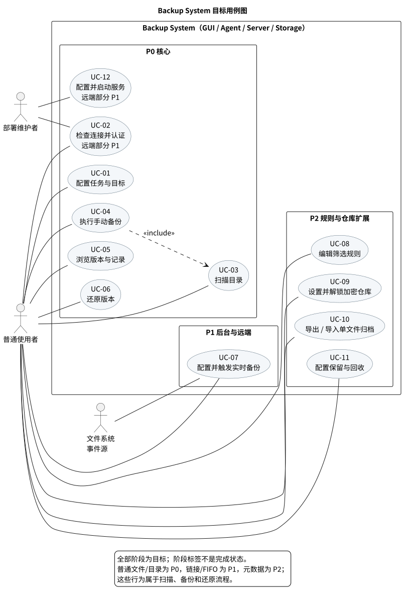

# Backup System 需求分析说明书

| 项目 | 内容 |
| --- | --- |
| 课程 | 软件开发综合实验 |
| 项目 | Backup System 数据备份与还原软件 |
| 文档版本 | 1.0，目标需求评审版 |
| 更新日期 | 2026-10-06 |
| 项目组与成员 | 提交前填写实际信息 |

> 本文规定最终应交付的行为，不表示代码已经实现。P0/P1/P2 都是本项目已选定的目标，只表示实施顺序。当前原型的实际能力见附录 A；测试结果见 [软件测试报告](test-report.md)。

2026-10-06：第 3.1 节基础功能已接入桌面程序；当前实现结构见[设计第 1.0 节](design.md)，验证范围见测试报告。附录 A 保留此前原型状态，红黄扩展仍为后续目标。

## 1. 引言

### 1.1 背景与目标

用户需要把 Linux 主机上的目录树保存到指定位置，在误删、误改或主机故障后选择一个历史版本还原。手工复制难以保证版本完整、恢复可验证、异常可追踪。本系统提供本地和远端备份目标，支持手动及后台实时备份，并允许从任一已完成版本恢复到 Agent 所在主机的新建或空目录。

本地目标的 Server 和 Storage 位于 Agent 主机；远端目标的 Server 和 Storage 位于另一台主机。两种模式使用同一套版本、校验和还原语义。把本地 Storage 放在源数据同一磁盘上只能验证软件功能，不能抵御整机或磁盘损坏；此限制必须在界面及部署说明中明确。

### 1.2 文档职责与编号

本文回答“系统应做什么”。[系统设计文档](design.md)回答进程、数据、接口和失败恢复“如何实现”。`FR-xx` 为功能需求，`NFR-xx` 为质量约束，`UC-xx` 为用例，`AC-xx` 为待执行验收/测试场景。每项测试的实际输出、执行时间、执行人员和程序版本应在测试报告中填写；本文不预填通过结果。

### 1.3 课程依据与范围解释

页码为 PDF 页面序号。

| 资料 | 本文采用的要求 |
| --- | --- |
| [ref/0.pdf](../ref/0.pdf)，第 3—5、7 页 | 基础功能为目录树备份与还原；第 4 页标红/标黄的扩展作为本项目优先目标；第 5 页说明语言与第三方实现对评分的影响；第 7 页列出提交物 |
| [ref/1.pdf](../ref/1.pdf)，第 15—20、40 页 | 用例图与用例描述；需求与系统设计分离；设计至少包含类图、顺序图和构件图 |
| [ref/3.pdf](../ref/3.pdf)，第 19—21、38 页 | 验收测试对应需求；测试用例应有条件、输入、步骤、预期与实际；项目报告至少两种测试类型、15 个以上用例 |
| [ref/4.pdf](../ref/4.pdf)，第 4—8 页 | AI 训练证书属于课程提交事项，不属于软件功能 |
| [ref/5.pdf](../ref/5.pdf)，第 3—6、17—26 页 | 界面、用例、静态/动态/构件建模示例及项目环节 |

`ref/0.pdf` 与 `ref/5.pdf` 对部分扩展的分值和分类不同；本文只固定功能范围，不预测得分。第 4 页的标色来自随文件保存的高亮批注：红色为文件类型、图形界面、实时备份；黄色为元数据、自定义备份、打包、压缩、加密。远端模式虽不在该红黄集合内，仍由项目组选为 P1 目标。网络模式首版单用户，不宣称具备多用户网盘的全部子项。定时备份、设备节点创建和跨设备硬链接不在承诺范围；版本保留策略是实时备份的容量控制，不等同于周期性定时备份。

第 3 节按“基础功能需求、红色标注的扩展需求、黄色标注的扩展需求”组织，网络备份和版本保留另列为项目补充需求。功能分类说明需求来源，P0/P1/P2 说明实施顺序；例如图形界面属于红色扩展，但从 P0 开始交付。

### 1.4 课程要求到文档的对应

| 课程项 | 已选目标或处理 | 需求 / 用例 / 验证 |
| --- | --- | --- |
| 0.pdf 第 4 页：基础备份/还原 | P0 必须形成数据闭环 | FR-04—06；UC-04—06；AC-04—09 |
| 文件类型（红） | P1 软链接、同卷硬链接、FIFO；设备识别跳过 | FR-10；UC-03、04、06；AC-17、18 |
| GUI（红） | P0 操作入口，后续阶段扩展对应控制 | FR-07；AC-13；设计第 7 节页面/流程 |
| 实时备份（红） | P1 常驻 Agent、关闭窗口后继续 | FR-09；UC-07；AC-14—16 |
| 元数据（黄） | P2 rwx、mtime、UID/GID | FR-12；UC-04、06；AC-21 |
| 自定义备份（黄） | P2 六类规则，组合与边界可验证 | FR-11；UC-08；AC-19、20 |
| 打包/解包（黄） | P2 完整版本的独立单文件导入导出 | FR-13；UC-10；AC-22、23、33 |
| 压缩/解压（黄） | P2 zstd 流式编码 | FR-14；AC-24、32 |
| 加密/解密（黄） | P2 仓库密码、内容/私有清单/归档认证加密 | FR-15；UC-09、10；AC-25、33 |
| 网络备份（项目选定） | P1 真上传/下载、认证、TLS；多用户候选 | FR-02、08；AC-10—12、29 |
| 定时备份 | 未选周期性调度；保留仅作容量策略 | FR-16 的边界，不据此宣称定时项完成 |
| 0.pdf 第 5 页：语言/库 | C++ 核心、脚本 GUI；第三方直接能力在设计第 8 节列出 | 课件明确扩展项使用第三方直接实现时按原总分 50% 计，具体适用由课程评定 |
| 1.pdf 第 40 页 / 5.pdf 第 26 页：建模 | 需求用例图/描述，设计类/顺序/构件图、界面、部署和构建 | 本文第 4 节；设计第 1—4、7—8 节及图源 |
| 3.pdf 第 21、38 页：测试 | 34 个待执行 AC、四类测试及记录模板 | 本文第 6 节；测试报告保留实际输出等字段 |
| 4.pdf / 0.pdf 第 7 页：提交 | 证书、三份报告、PPT、源码/构建、视频 | 本文第 6.3 节，不算软件功能 |

## 2. 系统概述

### 2.1 参与者与系统边界

| 参与者 | 目标与职责 |
| --- | --- |
| 普通使用者 | 管理源目录和目标，扫描、手动备份、查看版本、还原、配置实时触发和扩展规则 |
| 部署维护者 | 初始化/启动本机或远端 Server、配置数据目录、TLS 证书和单用户凭据，处理容量及服务故障 |
| 文件系统/事件源 | 向 Agent 提供文件内容、元数据和变化通知；事件是外部触发，不保证自身可靠 |

Electron Renderer/Main、C++ Agent、C++ Server 和 Storage 都是系统内部部件，不作为用例图中的外部用户。Storage 是 Server 管理的文件系统后端，不要求单独进程。Agent 运行在源文件和恢复目录所在主机；远端 Server 不直接访问 Agent 的源目录。

### 2.2 术语

| 术语 | 含义 |
| --- | --- |
| 目标/仓库 | 一组本地或远端 Server 连接与版本数据；一个目标可被多个目录任务使用 |
| 目录任务 | 源目录、目标、筛选规则、实时开关及保留策略的持久化配置 |
| 执行记录 | 一次扫描、备份、导入或还原的状态、进度、时间、错误与警告 |
| 版本 | 一次已完成备份形成的完整逻辑目录树；可引用此前版本的不可变内容对象 |
| 清单 | 版本中的相对路径、条目类型、大小、校验值、元数据及当次筛选配置 |
| 内容对象 | 按内容寻址、不可变的普通文件数据；不同版本可以引用同一对象 |
| 完成并有警告 | 选定范围内的数据完整，但有明确声明不支持的条目或元数据恢复限制 |
| 未完成 | 传输或提交尚未结束；不可作为可还原版本 |

### 2.3 里程碑与交付判据

三个阶段均属于最终目标；每阶段的交付需通过对应 AC，不能以界面入口或 `ping` 代替。

| 阶段 | 应形成的可用能力 | 退出条件 |
| --- | --- | --- |
| P0 基础闭环 | 本地目标、普通文件与目录、空目录、手动备份、可查询版本、校验后还原、GUI、失败记录 | 从真实目录备份两个版本并分别还原；中断的新版本不可见且旧版本可恢复 |
| P1 红色重点及远端 | 常驻 Agent、关闭 GUI 后实时备份、软链接/同卷硬链接/FIFO、远端真实上传下载、单用户认证与 TLS | 文件变化形成可恢复版本；关闭窗口后继续；远端断网/错误证书/错误凭据均安全失败 |
| P2 黄色重点 | 六类筛选、Linux 元数据、单文件归档导入导出、压缩、仓库密码加密、可配置版本保留 | 每项均有成功与异常验收场景，能从导出文件或加密仓库验证恢复 |

### 2.4 已确定的产品规则

1. 首版只还原到新建目录或空目录；非空目标拒绝。失败后已写入内容可保留并明确告知，不自动清理已有数据。
2. 扫描和备份默认纳入普通文件、隐藏文件及空目录。P1 纳入软链接、同一文件系统内的硬链接组和 FIFO。软链接只记录链接文本，不跟随；FIFO 不读取内容。字符/块设备和 socket 识别并列为跳过项，不创建节点。
3. 首版同一 Agent 同时只运行一个数据操作；实时事件按任务排队合并，额外手动请求明确返回忙碌。Server 的仓库提交/回收串行化，不允许两个执行改写同一版本。
4. 一次备份产生完整的逻辑版本；未变化内容可复用已有对象。默认不自动淘汰版本。未实现块级差量传输时，不宣称达到课程所说的“增量备份”全部范围。
5. 加密以仓库为单位启用；关闭窗口但 Agent 仍在运行时，已解锁密钥只留在 Agent 内存，实时任务继续。机器重启后，受保护任务暂停，用户重新登录并解锁仓库后恢复；不持久化明文密码。
6. 不承诺目录树的原子文件系统快照。验收的静止数据集应完整；检测到文件在读取期间大小、修改时间或内容发生变化时，本次版本失败并重试或提示。恢复时不自动覆盖源目录。名称范围为有效 UTF-8，非 UTF-8 名称必须报告，不能静默改名或遗漏。

## 3. 功能需求

本节先列出基础功能，再按课件标注顺序列出红色和黄色扩展。每项需求描述用户可执行的操作、系统应产生的结果及异常处理；具体进程、接口和存储格式见系统设计文档。沿用原有 `FR` 编号，便于与第 4 节用例和第 6 节测试对应，因此编号不按本节出现顺序排列。

| 分类 | 功能范围 | 对应需求 |
| --- | --- | --- |
| 基础功能 | 目录树备份与还原，以及任务、目标、扫描、版本和执行记录等配套功能 | FR-01—06、FR-17 |
| 红色标注扩展 | 文件类型支持、图形界面、实时备份 | FR-10、FR-07、FR-09 |
| 黄色标注扩展 | 元数据支持、自定义备份、打包解包、压缩解压、加密解密 | FR-12、FR-11、FR-13—15 |

### 3.1 基础功能需求

基础目标是将用户指定目录中的普通文件及子目录保存到指定备份位置，并能从备份中还原对应的目录树。任务配置、扫描预览、版本浏览和执行反馈用于支持这一过程。

#### FR-01 备份任务管理（P0）

- 用户应能创建、查看和移除备份任务，为任务选择本机源目录和备份目标。系统应拒绝无效目录，并阻止规范化后源路径与目标均相同的重复任务。
- 系统应持久保存任务配置；重新打开程序后，任务仍可查看和使用。配置保存失败时应说明原因；移除任务只移除配置，不删除源文件、仓库或历史版本。
- 实时任务的删除和目标切换应先停用监控并等待当前执行结束；其他配置变更只影响下次执行，进行中的备份继续使用开始时的配置。
- 从现有任务配置迁移时应保留任务标识和源路径；遇到冲突或损坏应报告并保留旧配置，不能静默丢失任务。

#### FR-02 备份目标配置与可用性检查（P0 本地，P1 远端）

- 用户应能配置目标名称、目标模式、服务地址和仓库，并将目标关联到备份任务。基础功能使用本机 Server 管理的本地仓库；远端目标的传输与认证要求见第 3.4 节。
- 用户应能检查目标是否可用。系统应区分检查中、可用、服务不可达和存储不可用等状态；依赖目标的操作失败时应显示原因。
- Server 应独立运行，关闭客户端不停止服务；启动时应验证数据目录和监听端口，失败时退出并报告原因。本机仓库数据目录与源目录不得互相包含，以避免重复备份仓库自身。

#### FR-03 目录扫描与备份预览（P0）

- 用户应能在备份前扫描源目录。系统应递归识别选定范围内的文件和目录，展示条目类型、文件数、目录数、普通文件内容总字节数及 SHA-256 校验值。
- 默认范围应包含普通文件、隐藏文件、空文件、子目录和空目录。预览可以限制显示条数，但统计应覆盖全部选定范围；启用自定义规则后，扫描和实际备份应使用相同的筛选规则。
- 无法读取或不支持的条目应列出路径和原因。源目录失效或遍历失败时，应标明扫描不完整；扫描本身不生成备份版本。

#### FR-04 数据备份（P0）

- 用户应能对任务手动发起备份。系统应将选定目录树的文件内容、相对路径和目录层级保存到目标仓库，保留空文件、空目录、隐藏条目以及中文和含空格的名称。
- 每次成功备份应产生一个可独立选择还原的完整逻辑版本。只有内容、清单和版本记录均通过校验并持久保存后，系统才能报告成功并在版本列表中展示该版本。
- 源文件不可读、读取期间发生变化、服务连接中断、校验失败或空间不足时，应停止本次备份并记录具体路径或阶段。失败或中断的半成品不可作为可还原版本，已有版本应保持可用。
- 对明确不支持而跳过的条目，应列出明细并将结果标记为“完成并有警告”。提交回执丢失时，应显示“结果待确认”并查询原执行结果，不能因重复请求产生重复版本。

#### FR-05 备份版本浏览（P0）

- 用户应能按目标和任务查看已完成版本，了解版本标识、源目录、完成时间、条目数、逻辑大小、当次筛选规则及警告，并选择版本进行还原或导出。
- 删除任务或重启服务后，已经完成的版本仍应能按仓库查询和还原。未完成及失败的操作只出现在执行记录中。
- 系统应区分“没有备份版本”和“版本查询失败”；历史版本中的内容和规则不随源目录或任务配置的后续修改而变化。

#### FR-06 数据还原与校验（P0）

- 用户应能选择已完成版本，将其还原到本机新建目录或空目录。系统应按备份时的相对路径重建文件和目录，不额外嵌套源根目录名，也不混入其他版本的文件。
- 写入前应检查目标目录。非空目标应拒绝；目标的规范路径与任何已配置源目录或本机仓库数据目录互相包含时也应拒绝，即使源目录为空。
- 系统应校验每个还原文件的 SHA-256，并检查路径、名称、空文件和目录结构与版本清单一致。特殊文件类型和元数据分别按 FR-10、FR-12 还原。
- 数据损坏或缺失、目标权限不足、空间不足、非法路径和操作中断均应报告失败，并列出已写入范围。还原不得修改备份源、仓库中的版本或目标中原有的文件。

#### FR-17 执行记录与异常反馈（P0）

- 系统应为扫描、备份、还原以及后续扩展中的导入、导出和清理保存执行记录，包括执行标识、开始及结束时间、阶段、状态、已处理文件数和字节数、错误与警告。用户重新打开客户端后应能查询已发起操作的结果。
- 请求无法发起时应立即反馈；进程异常退出或失联的操作应标记为未完成或失败。错误应能定位到操作、目标、版本或相对路径，记录中不得泄露密码。

### 3.2 红色标注的扩展需求

本组对应课件中的文件类型支持、图形界面和实时备份。文件类型支持扩展基础备份与还原的处理范围，图形界面提供操作入口，实时备份提供自动触发方式。

#### FR-10 文件类型支持（P1）

在普通文件和目录的基础上，系统应按以下规则处理特殊条目：

| 类型 | 备份要求 | 还原要求 |
| --- | --- | --- |
| 软链接 | 保存链接自身记录的目标路径文本，不跟随链接读取目标内容 | 按原文本重建软链接；目标不存在或位于备份范围外也保留链接语义 |
| 硬链接 | 将同一备份范围、同一文件系统内共享 inode 的普通文件记录为硬链接组，组内内容保存一份 | 重建选定成员之间的硬链接关系，使组内路径共享同一个 inode |
| 命名管道 FIFO | 记录路径和类型，不打开管道读取流内容 | 在对应路径重建 FIFO |
| 字符设备、块设备、socket | 识别类型并记录跳过项和原因 | 不创建这些节点，也不将其还原成普通文件 |

- 还原过程不得通过软链接写出目标目录。硬链接恢复仅连接本次版本中同组的已还原文件；需要跨设备创建硬链接或目标文件系统不支持时，应明确失败。
- 跳过不支持条目时，备份结果应标记为“完成并有警告”，并允许用户查看明细。

#### FR-07 图形界面（P0 起）

- 系统应提供图形界面，允许用户配置目标、管理任务、选择源目录、扫描预览、发起备份、浏览版本、选择还原位置以及查看执行记录。
- 红色和黄色扩展应有对应界面控制，包括实时备份开关、六类筛选规则、元数据恢复说明、打包解包入口、压缩选项和密码输入；控制项随对应阶段交付。
- 执行期间应展示当前阶段、处理文件数和字节数，并明确区分成功、完成并有警告、失败和未完成。长时间操作期间窗口应继续响应；重复提交、服务不可用和输入无效应有明确反馈。
- 中文、路径、错误原因、输入焦点和窗口控制应正常显示或使用；状态同时使用文字或图标表达，不能只依靠颜色。重新打开窗口后应能查看后台任务的当前状态和已有结果。
- 服务不可用时，本地任务管理和目录扫描仍应可用；依赖仓库的操作应说明不可用原因。

#### FR-09 实时备份（P1）

- 用户应能为任务开启或关闭实时监控。监控开启后，文件新增、修改、删除和重命名应自动触发备份，生成反映变化后的完整逻辑版本。
- Agent 应独立于图形界面常驻；关闭窗口后继续监控和备份，重新打开窗口后可查询期间的执行结果。
- 短时间连续变化应合并处理；备份期间发生的新变化应排队，在本次执行结束后重新扫描。事件队列溢出、连接恢复或 Agent 重启后，应重新核对整个选定范围，补偿可能遗漏的变化。
- 目标不可达、远端会话失效或加密仓库未解锁时，应分别显示待连接、待认证或待解锁，并保留待处理状态。恢复条件满足后重新扫描和备份，等待期间不得显示备份成功。

### 3.3 黄色标注的扩展需求

本组按课件顺序列出元数据支持、自定义备份、打包解包、压缩解压、加密解密。打包、压缩和加密是独立能力，可组合使用；组合后仍须能够恢复原始目录结构和文件内容。

#### FR-12 元数据支持（P2）

系统应为纳入版本的普通文件、目录、链接及 FIFO，在 Linux 文件系统支持的范围内保存并还原以下元数据：

| 元数据 | 保存与还原要求 |
| --- | --- |
| 属主和属组 | 保存 UID/GID；还原时在当前用户权限允许的情况下恢复，不自动提权 |
| 修改时间 | 保存 mtime，并在内容还原后恢复；目录时间应反映备份时记录的值 |
| 权限 | 保存并恢复读、写、执行权限位；Linux 软链接权限位不作为恢复承诺 |

- 链接的元数据操作应作用于链接自身，不跟随其目标。文件内容和条目建立后，再应用可恢复的元数据。
- 任一应恢复的元数据因权限或文件系统限制而失败时，应逐项列出路径、字段和原因，并报告“内容已恢复、元数据未完全恢复”。
- 本阶段的范围不包括 ACL、扩展属性、访问时间、状态变更时间及特殊权限位；验收应在支持相应语义的 Linux 文件系统上执行。

#### FR-11 自定义备份（P2）

用户应能通过以下六类条件选择需要备份的文件，并为每类设置选入或排除规则：

| 条件 | 用户可设置的内容 |
| --- | --- |
| 路径 | 相对源目录的路径或路径通配规则；排除目录时排除整棵子树 |
| 类型 | 普通文件、目录、软链接、硬链接成员、FIFO 等已支持条目 |
| 名字 | 基本文件名及 `*`、`?` 通配规则，区分大小写 |
| 时间 | 文件修改时间范围，区间包含两端边界 |
| 尺寸 | 普通文件及硬链接成员的字节大小范围，区间包含两端边界 |
| 用户 | 文件属主 UID，可指定多个 UID |

- 同一类别的多个选入条件按“或”组合，不同类别按“且”组合；任意排除条件命中时优先排除。未设置规则时采用默认备份范围。
- 路径通配中的 `*`、`?` 不跨越 `/`；路径和名称均按 Linux 大小写敏感规则匹配。无效区间、负大小、非法 UID 或越界路径应拒绝保存，并保留原有有效规则。
- 入选文件所需的父目录应保留；任何类别的排除条件命中目录时，均排除其子树，结构父目录不能绕过排除规则。未被排除的空目录按适用的目录规则处理。
- 目录不适用大小条件；软链接和 FIFO 不匹配大小选入条件。扫描预览、手动备份和实时备份应使用一致规则，每个版本应保留当次规则，后续修改不影响历史版本。

#### FR-13 打包与解包（P2）

- 用户应能将任一已完成版本打包导出为单个归档文件。归档应包含该版本的完整目录清单、文件内容及已支持的类型和元数据，使其能够独立于原仓库保存和使用。
- 用户应能选择归档文件进行解包导入。系统应校验归档，在目标仓库中形成完整版本，再按 FR-06 还原目录和文件；即使原仓库不可用，也应能够完成这一过程。
- 截断、损坏、格式版本不支持、密码错误、空间不足或操作中断时，应报告失败且不产生可还原的半成品版本。原版本和目标仓库中的已有版本应保持可用。
- 导入到不同压缩或加密策略的仓库时，应先验证归档，再按目标仓库策略保存；压缩与加密要求分别见 FR-14、FR-15。

#### FR-14 压缩与解压（P2）

- 用户应能在仓库策略中启用或关闭压缩。本阶段支持 zstd，备份对象和归档应记录实际使用的算法、原始长度及校验信息。
- 系统应采用无损压缩，在可压缩数据集上减少备份的实际存储占用。还原或导入时应按记录自动解压，解压后的文件内容和长度应与备份前一致。
- 压缩与未压缩对象可以共存；修改设置只影响新写入对象，历史版本应继续可读。
- 压缩失败、压缩数据损坏、解压长度不符或内容校验失败时，应终止本次执行并报告原因，不发布损坏文件或半成品版本。

#### FR-15 加密与解密（P2）

- 用户应能在创建仓库时指定密码并启用加密。启用后，文件内容、私有清单及导出归档均应以认证加密形式保存；仅仓库状态所必需的非私有字段可明文保存。
- 用户提供正确密码解锁后，应能备份、读取、导入和还原受保护的数据。错误密码、密文损坏或认证标签不符时，应拒绝相应操作；未经验证的还原文件不得发布，此前已验证文件应作为部分结果列出。
- 仓库密码应与远端账户密码独立，不传给 Server，不写入日志或明文配置。Agent 应验证解密后的内容和认证标签；Server 仅验证存储字节及引用完整性，不持有仓库密钥。
- 已解锁密钥只保存在 Agent 内存中。关闭窗口而 Agent 仍运行时实时备份可继续；机器或 Agent 重启后，受保护任务暂停，用户再次解锁后恢复。
- 已有明文仓库不能仅通过切换开关标为“全部已加密”；用户应新建加密仓库或完成经过验证的迁移。

### 3.4 项目补充需求

以下保留原方案中已选定的网络备份和版本保留目标，作为三组课程需求之外的补充。网络备份在课件中属于蓝色标注；版本保留用于容量管理，不等同于周期性定时备份。定时备份仍不纳入当前承诺范围，网络备份的首版边界见 FR-08。

#### FR-08 网络备份、身份认证与传输保护（P1）

- 用户应能通过 FR-02 配置远端主机上的 Server 和仓库。系统应实际上传备份内容，在远端保存版本，并将所需数据下载回 Agent 主机还原；仅连接检查成功不构成网络备份。
- 首版远端访问使用部署维护者设置的单一账户。未认证或凭据错误时，系统不得允许列出版本、上传、下载或删除数据；凭据不能明文写入任务配置或日志。
- Agent 应验证 Server 的 TLS 证书及主机身份。证书不可信、过期或名称不符时应拒绝连接，不提供常规的“忽略证书”开关；传输中的文件内容和账户凭据应受到加密保护。
- 连接检查应分别反馈认证失败、证书失败、网络失败和存储不可用。关闭 GUI 后，有效会话可由常驻 Agent 继续使用；Agent 重启后需要重新认证，登录状态与仓库解锁状态分别管理。

#### FR-16 版本保留与空间回收（P2）

- 用户应能为任务设置版本保留数量和时间条件，默认关闭自动删除。启用前应展示候选列表并确认，启用后每次成功备份按策略执行。
- 数量与时间同时启用时，先保护最近 N 个版本，再删除其余超过年龄 T 的版本；只按年龄时至少保留最新版本。正在使用的版本应延后回收。
- 删除版本只能回收不再被引用的内容，不能破坏其他版本共享的数据。空间不足时应明确失败，不能默认删除旧版本腾出空间。

## 4. 用例模型

### 4.1 用例图

[PlantUML 可编辑源文件](diagrams/requirements-use-cases.puml)。关联线表示参与者与系统用例的交互；UC-04 包含 UC-03 的扫描行为。UC-03、UC-04、UC-06 中的特殊类型和元数据处理是扫描/备份/还原流程的阶段性扩展，不把 Agent/Server 画成外部参与者。

下表每个用例均给出参与者、触发、前置条件、基本流程、异常流程以及成功/失败结束状态；目标功能未实现时仍以未来行为描述。

### UC-01 配置任务与目标

| 项目 | 描述 |
| --- | --- |
| 参与者/触发 | 普通使用者选择添加目录或目标、编辑或移除任务 |
| 前置条件 | Agent 可用；配置任务时选定的源目录存在；配置目标无需先创建任务 |
| 基本流程 | 1. 输入源目录和本地/远端目标；2. 校验路径、模式与重复项；3. 保存并展示；4. 删除任务时仅移除配置 |
| 异常流程 | 用户取消不写入；配置不可保存、源目录无效或与本地 Storage 重叠时说明原因并保留旧配置 |
| 成功/失败结束状态 | 成功：重启后任务与目标仍可见；失败：旧配置和源/版本均不变 |
| 关联需求 | FR-01、FR-02 |

### UC-02 检查连接并认证

| 项目 | 描述 |
| --- | --- |
| 参与者/触发 | 普通使用者点击检查连接，或 Agent 准备远端操作 |
| 前置条件 | 目标已配置；远端提供账户凭据与可信证书配置 |
| 基本流程 | 1. 连接目标；2. 远端验证证书和身份；3. 返回服务与仓库状态；4. 显示可用状态 |
| 异常流程 | 服务未运行、超时、错误凭据、证书不可信或 Storage 不可用时分类提示，不执行备份/还原 |
| 成功/失败结束状态 | 成功：目标可授权访问；失败：本地任务和扫描仍可用，不泄露凭据 |
| 关联需求 | FR-02、FR-08 |

### UC-03 扫描目录

| 项目 | 描述 |
| --- | --- |
| 参与者/触发 | 普通使用者点击扫描 |
| 前置条件 | 任务存在且源目录可访问 |
| 基本流程 | 1. 读取任务规则；2. 遍历条目、识别类型、计算普通文件哈希；3. 展示统计、预览和警告 |
| 异常流程 | 源消失或遍历/读取失败时列出路径和不完整状态；不生成备份版本 |
| 成功/失败结束状态 | 成功：扫描结果准确且标明“未备份”；失败：显示定位信息，不伪称成功 |
| 关联需求 | FR-03、FR-10、FR-11 |

### UC-04 执行手动备份

| 项目 | 描述 |
| --- | --- |
| 参与者/触发 | 普通使用者点击备份 |
| 前置条件 | 任务、源和目标有效；仓库已认证并按需解锁；Agent 无其他数据操作 |
| 基本流程 | 1. 扫描并冻结当次规则；2. 创建执行与暂存版本；3. 分块传输所需对象和清单；4. 校验并持久化；5. 原子提交版本；6. 显示结果及跳过项 |
| 异常流程 | 文件变化/不可读、网络中断、空间不足、校验或提交失败时记录失败，半成品不可列出；提交回执丢失时显示“结果待确认”，按原执行标识查询；旧版本不受损 |
| 成功/失败结束状态 | 成功：版本可查询并还原；失败：有可定位记录、无半成品成功版本 |
| 关联需求 | FR-04、FR-10、FR-11、FR-12、FR-14、FR-15、FR-17 |

### UC-05 浏览版本与记录

| 项目 | 描述 |
| --- | --- |
| 参与者/触发 | 普通使用者打开版本或执行记录 |
| 前置条件 | 仓库可访问；加密仓库已解锁 |
| 基本流程 | 1. 选择目标；2. 查询已提交版本和执行记录；3. 查看当次规则、条目与警告；4. 选择版本用于还原/导出 |
| 异常流程 | 空仓库显示空状态；查询失败显示错误；不把失败执行混入可还原版本 |
| 成功/失败结束状态 | 成功：版本可辨且与任务是否仍存在无关；失败：不显示伪造的空历史 |
| 关联需求 | FR-05、FR-17 |

### UC-06 还原版本

| 项目 | 描述 |
| --- | --- |
| 参与者/触发 | 普通使用者选择版本与恢复目录 |
| 前置条件 | 版本已提交；目标新建或为空且不与已配置源/本机 Server 数据根重叠；仓库可读且已按需解锁 |
| 基本流程 | 1. 验证目标和清单路径；2. 下载/读取对象并恢复普通文件、目录、链接及 FIFO；3. 校验内容；4. 按阶段恢复元数据；5. 展示结果 |
| 异常流程 | 非空或与源/仓库重叠的目标、路径越界、损坏、断线、权限或空间不足时停止，列出失败项与部分写入范围 |
| 成功/失败结束状态 | 成功：目标符合版本清单；失败：旧文件、源和仓库版本均不改写 |
| 关联需求 | FR-06、FR-10、FR-12、FR-15、FR-17 |

### UC-07 配置并触发实时备份

| 项目 | 描述 |
| --- | --- |
| 参与者/触发 | 用户开启监控；文件系统通知 Agent 发生变化 |
| 前置条件 | 任务有效，常驻 Agent 在运行 |
| 基本流程 | 1. 监控目录；2. 合并变化并重新扫描；3. 创建完整逻辑版本；4. 通知状态；5. 窗口关闭后继续 |
| 异常流程 | 执行中事件排队；溢出/重启后全量对账；离线或仓库锁定时暂停并保留待处理状态 |
| 成功/失败结束状态 | 成功：变化形成可恢复版本；失败：无伪成功，恢复条件后对账重试 |
| 关联需求 | FR-09、FR-17 |

### UC-08 编辑筛选规则

| 项目 | 描述 |
| --- | --- |
| 参与者/触发 | 普通使用者编辑六类规则 |
| 前置条件 | 任务存在，P2 功能可用 |
| 基本流程 | 1. 输入选入/排除规则；2. 校验；3. 预览范围；4. 保存至任务；5. 后续扫描与备份采用该版本 |
| 异常流程 | 无效区间、非法 UID 或保存失败时保留旧规则；旧备份版本不变 |
| 成功/失败结束状态 | 成功：规则在扫描、备份和清单中一致；失败：原规则继续有效 |
| 关联需求 | FR-11 |

### UC-09 设置并解锁加密仓库

| 项目 | 描述 |
| --- | --- |
| 参与者/触发 | 用户创建受保护仓库或重启后解锁 |
| 前置条件 | 仓库尚未创建，或已有受保护仓库且用户知道密码 |
| 基本流程 | 1. 设置/输入仓库密码；2. Agent 本地派生密钥并验证；3. 密钥保存在内存；4. 允许备份和还原 |
| 异常流程 | 错误密码拒绝读取；重启后未解锁时实时任务暂停；已有明文仓库不能原地切换成“已全部加密” |
| 成功/失败结束状态 | 成功：内容与清单按仓库策略处理；失败：无明文泄露、无伪成功 |
| 关联需求 | FR-15、FR-08、FR-09 |

### UC-10 导出/导入单文件归档

| 项目 | 描述 |
| --- | --- |
| 参与者/触发 | 用户选择版本导出，或选择归档文件导入 |
| 前置条件 | 版本已提交或归档文件可读；必要密码已提供 |
| 基本流程 | 1. 导出完整清单及对象至单文件；2. 用户选择文件导入；3. 验证格式、内容与密码；4. 按目标仓库策略保存并提交版本 |
| 异常流程 | 文件截断/损坏、密码错误、空间不足或导入中断时失败且不出现可还原半成品 |
| 成功/失败结束状态 | 成功：不依赖原仓库即可恢复；失败：原版本和目标仓库旧版本不变 |
| 关联需求 | FR-13、FR-14、FR-15、FR-17 |

### UC-11 配置保留与回收

| 项目 | 描述 |
| --- | --- |
| 参与者/触发 | 用户保存保留规则或主动执行清理 |
| 前置条件 | 目标可用；有删除权限；默认策略为关闭 |
| 基本流程 | 1. 设置数量/年龄条件；2. 预览候选版本；3. 执行标记删除；4. 回收无引用对象；5. 展示结果 |
| 异常流程 | 正在读取的版本延迟清理；中断后可重试；共享对象仍有引用时绝不删除 |
| 成功/失败结束状态 | 成功：符合规则的旧版本移除，保留版本可还原；失败：已保留版本仍完整 |
| 关联需求 | FR-16、FR-17 |

### UC-12 配置并启动服务

| 项目 | 描述 |
| --- | --- |
| 参与者/触发 | 部署维护者初始化/启动 Server |
| 前置条件 | 已提供绝对数据目录；远端模式准备有效证书和单用户凭据 |
| 基本流程 | 1. 检查目录和权限；2. 打开元数据库与 Storage；3. 恢复未完成执行状态；4. 监听本地或远端地址；5. 输出监听信息 |
| 异常流程 | 参数/端口/证书/目录错误时退出并报告原因，不宣称启动成功 |
| 成功/失败结束状态 | 成功：Server 独立运行且旧版本可查；失败：旧数据不被删除 |
| 关联需求 | FR-02、FR-08、FR-17 |

## 5. 数据规则与质量要求

### 5.1 持久化数据

| 数据 | 必要信息与边界 |
| --- | --- |
| 任务/目标 | ID、规范化源路径、目标模式与仓库、当下规则、监控与保留设置；不存明文密码 |
| 执行记录 | ID、类型、阶段、状态、关联版本/任务、时间、字节/条目进度、错误/警告 |
| 已提交版本 | ID、创建时间、源目录标签、逻辑大小、清单引用、当次规则、警告；任务删除后独立存在 |
| 清单条目 | 相对路径、类型、大小、SHA-256/对象引用、链接目标或硬链接组、元数据 |
| 内容对象 | 不可变 ID、算法/格式、存储长度、校验信息、引用状态；加密仓库仅暴露必要的非私有字段 |
| 仓库凭据 | 远端账户验证材料由 Server 保存；仓库密码派生材料不包含明文密码，派生密钥只在 Agent 内存 |

版本清单只接受规范化相对路径，拒绝绝对路径、`..` 越界、重复或冲突路径；恢复不能借目标目录中的软链接写到范围外。所有文件操作限制在目标根目录内。私有清单和文件内容在加密仓库中均为密文。源逻辑字节、网络传输字节与 Storage 占用是不同指标，应分别命名。

### 5.2 非功能需求

| 编号 | 要求 | 验证依据 |
| --- | --- | --- |
| NFR-01 正确性 | 静止目录的已提交版本可重建同一范围的路径、类型和普通文件字节；包括空文件/目录和中文名 | AC-04、AC-05、AC-17 |
| NFR-02 事务可见性 | 中断/崩溃不会让未完成版本可恢复，不会改写旧版本；Server 重启能识别悬挂执行 | AC-07、AC-12、AC-34 |
| NFR-03 数据完整性 | 备份与恢复校验内容，损坏或缺失数据必报错；加密数据验证认证标签 | AC-09、AC-23、AC-25、AC-32、AC-33 |
| NFR-04 资源使用 | 文件读取、传输、压缩、归档和恢复采用分块处理；单个 1 GiB 文件不得整体装入 Agent/Server 内存 | AC-28 |
| NFR-05 安全性 | 远端 TLS 证书及单用户身份必须验证；无明文凭据落盘；非法路径不能写出恢复目标 | AC-10、AC-11、AC-25、AC-27 |
| NFR-06 可用性 | GUI 处理长操作仍可响应；关闭 GUI 不停止常驻 Agent；运行状态重开后可见 | AC-13、AC-15 |
| NFR-07 可观测性 | 连接、认证、源、存储、校验和恢复失败均显示可定位原因，日志不含密码 | AC-02、AC-08、AC-11、AC-30 |
| NFR-08 可移植/可构建 | 目标验收为 Linux/WSL，C++20 + Qt 6 + Meson/Ninja，Electron/React 界面可重复构建 | AC-13、AC-28 |
| NFR-09 恢复边界 | 非空目标拒绝、失败可部分写入但不删除既有文件；元数据无法恢复时不得声称完整成功 | AC-06、AC-21、AC-27、AC-31 |
| NFR-10 存储隔离 | 实际备份与数据库进入指定数据目录，不进入源码或构建目录；同盘部署风险明确告知 | AC-02、AC-04 |

性能报告要记录 CPU、内存、文件系统、数据规模、扫描/备份/还原时间与峰值内存；在实测前不承诺固定吞吐量或百万文件规模。

## 6. 需求追踪与待执行测试

`AC` 表示已设计的测试场景，不代表通过。表中的“类型”用于后续报告至少覆盖两种测试类型；执行时记录软件版本、预置条件、实际输出、时间和人员。P0/P1/P2 均有对应场景，阶段未交付时填“未执行”，不得填“通过”。

| 需求 | 用例 | 测试 |
| --- | --- | --- |
| FR-01 | UC-01 | AC-01 |
| FR-02 | UC-01、02、12 | AC-02、10、11、30 |
| FR-03 | UC-03 | AC-03 |
| FR-04 | UC-04 | AC-04、07、08、12、28、31、34 |
| FR-05 | UC-05 | AC-05、07 |
| FR-06 | UC-06 | AC-05、06、09、12、17、21、27、31、33 |
| FR-07 | UC-01—11 | AC-13 |
| FR-08 | UC-02、09、12 | AC-10、11、12、29 |
| FR-09 | UC-07、09 | AC-14—16、25 |
| FR-10 | UC-03、04、06 | AC-17、18 |
| FR-11 | UC-03、04、08 | AC-19、20 |
| FR-12 | UC-04、06 | AC-21 |
| FR-13 | UC-10 | AC-22、23、33 |
| FR-14 | UC-04、10 | AC-24、32 |
| FR-15 | UC-04、06、09、10 | AC-25、33 |
| FR-16 | UC-11 | AC-26 |
| FR-17 | UC-04—07、10—12 | AC-07、08、12、14、26、30、31、34 |

### 6.1 测试数据与记录规则

测试在独立的临时源目录、空目标仓库及恢复目录进行；不对用户真实数据制造故障。基础样本包含空目录、隐藏文件、零字节文件、`sub/中文 名称.txt`、1 GiB 大文件和多版本变更。特殊样本在支持 inode、软链接和 FIFO 的 Linux 文件系统上构造。远端样本在两台主机或隔离网络命名空间中运行，使“真实跨主机传输”可观察。权限、空间、断网和损坏通过受控测试仓库注入。

每条测试执行记录应填写：程序版本、模块、AC 编号与名称、测试类型/级别、预置条件、输入、操作步骤、预期结果、实际输出、执行时间、执行人员和证据位置。下表给出条件/输入/步骤/预期，正式测试报告引用编号并填写其他字段。

### 6.2 测试场景

| 编号/阶段/类型 | 输入与预置条件 | 操作步骤 | 预期结果 |
| --- | --- | --- | --- |
| AC-01 / P0 / 验收 | 已存在源目录，任务列表初始为空 | 添加相同目录两次，重启 GUI/Agent，移除任务 | 仅一条任务；重启后仍在；移除不删除源或已完成版本 |
| AC-02 / P0 / 集成 | 本地 Server 数据目录有效；另备不可写目录与占用端口 | 启动服务，检查目标；分别在不可写目录和占用端口启动 | 成功时仅在指定目录建库/Storage；两种故障有原因且无虚假监听成功 |
| AC-03 / P0 / 验收 | 基础样本含隐藏、空文件/目录、中文与空格名 | 扫描并查看列表/统计 | 文件数、大小、哈希与实物相同；未产生版本；错误文件有路径 |
| AC-04 / P0 / 验收 | 基础样本、空仓库 | 执行本地备份并重启 Server | Storage 有真实数据；仅提交后出现版本；重启后仍可浏览 |
| AC-05 / P0 / 验收 | 版本 A；修改/新增/删除后形成版本 B | 分别还原到两个空目录并逐文件比较 SHA-256 | A/B 各自匹配当次树，空目录存在，互不混入文件 |
| AC-06 / P0 / 验收 | 非空恢复目录与哨兵文件；另有已配置的空源目录 | 尝试还原到两种目录，再取消一次选择 | 拒绝非空目标和与源重叠目标；哨兵/空源均不变；取消不写内容 |
| AC-07 / P0 / 集成 | 先有完整版本 A，另有足够大的新版本 | 传输中终止 Server，重启并查询/还原 A | 新版本不可还原；执行为失败/未完成；A 仍完整 |
| AC-08 / P0 / 集成 | 读取中会被修改的普通文件、不可读文件 | 触发备份并改变文件或撤销读取权限 | 不产生完整版本；指出文件与原因；旧版本不变 |
| AC-09 / P0 / 集成 | 专用测试仓库中一个对象被截断/替换 | 对该版本执行还原 | 校验失败，明确相关路径和可能的部分结果，不显示成功 |
| AC-10 / P1 / 验收 | 两台主机/隔离网络、正确账户和可信证书 | 从 Agent 备份到远端，断开源后查询并下载还原 | 远端 Storage 收到真实数据；下载所得内容与清单一致 |
| AC-11 / P1 / 集成 | 错误密码、过期/名称不符证书 | 分别连接远端并尝试列版本/上传 | 身份或证书验证失败，Server 不提供数据，密码不出现在日志 |
| AC-12 / P1 / 集成 | 已有远端版本 A，正在上传版本 B | 中途断网，重连并查询、还原 A | B 不可还原；A 可还原；执行状态和错误可追踪 |
| AC-13 / P0 / 验收 | Linux/WSL 环境具 README 所列依赖，源码和测试数据就绪 | 按 README 构建并启动 GUI；执行较长扫描，导航任务/版本/还原页，操作窗口控制 | C++ 与前端均可按说明构建；页面/窗口控制可用，中文正确，长操作不冻结 UI |
| AC-14 / P1 / 验收 | 实时任务有效，源目录可写 | 在短窗口内连续新增、修改、重命名和删除 | 变化合并为可还原的完整逻辑版本，结果对应稳定后目录树 |
| AC-15 / P1 / 集成 | 常驻 Agent 监控未加密任务，远端已认证 | 关闭 GUI 后修改文件，重开 GUI；重启 Agent 并重新认证 | 关闭期间继续备份；重开可查结果；重启后先待认证，认证后恢复监控与对账 |
| AC-16 / P1 / 集成 | 监控队列溢出或故意丢失事件 | 制造溢出/重启并比较当前目录与新版本 | Agent 全量对账，最终版本不遗漏静止后的变化 |
| AC-17 / P1 / 验收 | 相对/外部目标软链接、两个同 inode 路径、FIFO | 备份并还原，执行 `readlink`、`stat` 和类型检查 | 链接文本、组内 inode 关系、FIFO 类型正确；不读取 FIFO |
| AC-18 / P1 / 集成 | 受控目录含设备节点或 socket | 执行扫描及备份 | 明确列出跳过项并标“完成并有警告”；不创建设备内容 |
| AC-19 / P2 / 验收 | 附录 B 的固定六类筛选样本 | 分别采用 B-01 至 B-09 的完整配置，扫描/备份/还原 | 每组均符合附录预期清单；边界包含、同类或、跨类且、排除优先，三处范围一致 |
| AC-20 / P2 / 单元 | 负大小、反向区间、非法 UID、越界路径 | 向规则校验器分别提交 | 每项拒绝且不覆盖已保存的有效规则 |
| AC-21 / P2 / 验收 | 具不同权限、mtime、UID/GID 的文件/目录/链接 | 备份还原，有权限和无权限身份各运行一次 | 可应用元数据一致；无法 chown 的项逐一报告且不称“完全成功” |
| AC-22 / P2 / 验收 | 已提交版本及另一空仓库 | 导出单文件，移走原仓库，导入并还原 | 导出文件独立可解包；导入版本内容与原版本一致 |
| AC-23 / P2 / 集成 | 截断/篡改的导出归档 | 尝试导入 | 校验失败，无半成品可还原版本，旧版本不变 |
| AC-24 / P2 / 验收 | 可压缩与不可压缩文件各一组 | 用 zstd/无压缩目标备份并还原，比较实际占用 | 可压缩样本占用减少；两组还原 SHA-256 一致，算法字段正确 |
| AC-25 / P2 / 集成 | 加密仓库、正确/错误仓库密码；已配置实时任务 | 检查 Storage/归档字节；分别解锁还原；关闭 GUI 后变更，再重启 Agent 并解锁 | 无内容/私有清单明文；错密码失败、正确恢复一致；关闭 GUI 继续，重启后待解锁，解锁后对账 |
| AC-26 / P2 / 集成 | 3 个版本共享部分内容，保留 2 个，默认关闭 | 先验证默认不删除，再启用并执行清理 | 仅候选版本被删；共享对象及其余版本仍可恢复 |
| AC-27 / P0 / 集成 | 清单含绝对路径、`..`、重复路径或指向外部的中间软链接 | 尝试还原并核对目标外哨兵；P2 追加归档导入同类恶意清单 | 非法清单拒绝；目标外文件和原有文件不变 |
| AC-28 / P0 / 性能 | 分别使用 64 MiB 和至少 1 GiB 的单文件数据集；记录测试机配置 | 独立备份和还原两组，比较空载/峰值内存与耗时 | 内容一致，Agent/Server 内存不随整文件大小线性增长；数据位于指定根目录 |
| AC-29 / P1 / 集成 | 未认证会话、零长度/超限长度帧；测试代理注入错误 request_id 响应 | 向远端发送非法帧/未授权查询，再观察 Agent 对错配响应的处理 | Server 拒绝未授权/非法帧；Agent 不把错配响应当成功；无数据泄露 |
| AC-30 / P0 / 集成 | Server 停止，或数据目录被限制写入 | GUI 检查连接并尝试备份；恢复服务再检查 | 错误分类显示；本地任务/扫描可用；恢复后可重新操作 |
| AC-31 / P0 / 集成 | 专用限容量存储/恢复目录，旧版本 A 和大于剩余容量的数据 | 分别在上传、恢复阶段耗尽空间，并测试目标无写权限 | 新备份失败且 A 可恢复；恢复列出部分范围/权限原因；不删旧数据腾空间 |
| AC-32 / P2 / 集成 | zstd 对象/归档，篡改压缩字节或声明的解压长度 | 尝试恢复/导入 | 解压/长度校验失败，有定位错误；不发布损坏文件或半成品版本 |
| AC-33 / P2 / 集成 | 加密版本/归档，篡改标签、引用索引或移除最终块 | Agent 下载解码/导入；另将完整归档导入新加密仓库 | 标签/绑定/截断均失败且不发布该文件；完整归档按新策略重编码后可还原 |
| AC-34 / P0 / 集成 | 已完成版本 A，新备份 B 的提交回执被测试代理丢弃 | 查询原 operation_id，重复 Commit；在数据库提交前后分别终止服务 | 结果查询确定 B 是否提交；重复提交至多一个版本；提交前半成品不可见、提交后可恢复 |

### 6.3 课程提交检查项

项目提交时另行核对需求、设计、测试三份报告，答辩 PPT、源码/可执行程序与构建脚本、三分钟以内演示视频，并以课程平台最新通知确认提交方式和截止日期。[ref/4.pdf](../ref/4.pdf) 所述 AI 训练证书是课程事项，不能写作备份软件的功能或测试结果。测试报告至少含两种已实际执行的测试类型和 15 个以上已记录用例；本节只是待执行目录。

## 附录 A：当前代码状态（2026-10-01）

以下是本次文档工作前对源码和现有测试的核对，不代表任何目标阶段已完成。

| 能力 | 当前证据与状态 |
| --- | --- |
| GUI 与任务 | [Electron Main](../apps/backup-desktop/electron/main.ts) 保存 userData 下的 `tasks.json`；[界面](../apps/backup-desktop/src/App.tsx) 可添加/移除目录，已有窗口控制代码 |
| Agent 生命周期 | [AgentBridge](../apps/backup-desktop/electron/agent-bridge.ts) 按需启动子进程并在退出时终止；尚非常驻服务，也没有 Unix socket |
| 扫描 | [C++ Agent](../apps/backup-agent/main.cpp) 遍历普通文件并算 SHA-256，样本最多 100 条；软链接被跳过；无备份上传 |
| 网络 | TCP 长度帧 JSON 目前只支持 `ping/pong`；地址限制为 `127.0.0.1:9000`；无 TLS、认证或文件流 |
| Server/Storage | [Server](../src/server/backup_server.cpp) 创建 `database/` 和 `storage/`，未生成元数据库，Storage 尚不保存备份对象 |
| 版本与扩展 | 备份提交、版本查询、还原、实时、筛选、特殊文件、元数据、归档、压缩、加密和保留策略均未实现 |
| 已有测试 | 已有协议帧、服务连通/扫描、窗口测试脚本；覆盖范围不包含完整备份与还原 |

当前工作区已存在 Git 元数据；本文依据本次查看的源码快照，不据此推断历史功能已完成。正式提交前应填写组员和实际测试记录，使源码、需求、设计与测试报告的完成状态一致。

## 附录 B：AC-19 固定筛选样本

在原生 Linux 临时目录建立如下样本，普通文件内容填充到指定字节长度；U 为执行者 UID，V 为另一测试 UID，设置 V 的场景用有权限的受控环境。m1=2026-09-01T00:00:00Z，m2=2026-09-02T00:00:00Z。

| 相对路径 | 类型 / UID | 大小 / mtime |
| --- | --- | --- |
| sub/a.txt | 普通 / U | 10 字节 / m1 |
| sub/b.txt | 普通 / U | 20 字节 / m2 |
| sub/c.txt | 普通 / U | 9 字节 / m1 |
| sub/d.txt | 普通 / U | 21 字节 / m2 |
| sub/e.log | 普通 / U | 15 字节 / m1 |
| sub/f.txt | 普通 / V | 15 字节 / m1 |
| sub/old.txt | 普通 / U | 15 字节 / m1 之前 1 秒 |
| cache/a.txt | 普通 / U | 15 字节 / m1 |
| link.txt / pipe.txt | 软链接 / FIFO，U | 无内容大小 |

各组独立执行，未列出的类别不设置选入或排除规则；不要沿用上一组的条件。表中只列非目录条目，入选条目的结构父目录必须存在，未入选的非空目录不单独保留。link.txt 指向 sub/a.txt，pipe.txt 为 FIFO；目录本身不适用大小条件。B-01 的默认配置只用于本测试，产品默认仍为不筛选。

| 组号 | 完整筛选配置 | 预期非目录条目 |
| --- | --- | --- |
| B-01 六类组合 | 路径选入 sub/ 或 cache/，排除 cache/；类型普通；名称 *.txt；大小 [10,20]；mtime [m1,m2]；UID U | sub/a.txt、sub/b.txt |
| B-02 属主替换 | 与 B-01 相同，仅 UID 改为 V | sub/f.txt |
| B-03 类型或 | 类型选入软链接或 FIFO | link.txt、pipe.txt |
| B-04 名称单字符 | 路径选入 sub/；类型普通；名称 ?.txt | sub/a.txt、sub/b.txt、sub/c.txt、sub/d.txt、sub/f.txt |
| B-05 同类或 | 路径选入 sub/；类型普通；名称选入 a.txt 或 e.log | sub/a.txt、sub/e.log |
| B-06 排除优先 | B-01 加名称排除 b.txt | sub/a.txt |
| B-07 目录排除 | 路径选入 sub/；名称排除 sub；其他类别不限 | 无条目，不重建被排除的 sub/ |
| B-08 名称无匹配 | 路径选入 sub/；名称 a?.txt；类型普通 | 无条目，? 必须匹配一个字符 |
| B-09 目录结构 | 不设置选入条件；类型排除软链接或 FIFO | sub/ 下所有 7 个文件和 cache/a.txt；目录保留 |

B-01 同时验证大小 10/20 字节与 mtime m1/m2 的闭区间边界，以及 9/21 字节和 m1 前 1 秒的拒绝；B-02 至 B-09 验证条件替换、通配、组合和结构父目录。每组比较扫描预览、已提交清单和恢复树，并逐条记录实际结果。
